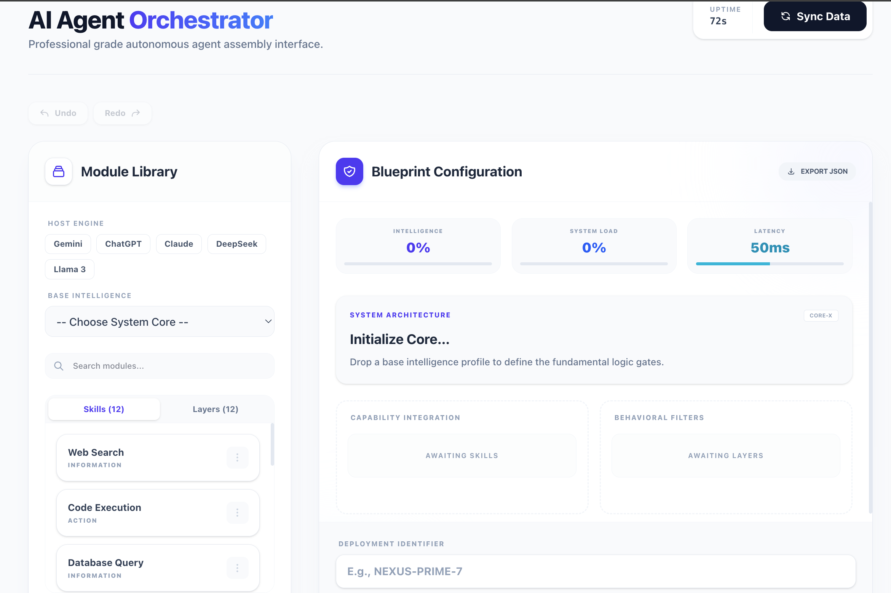

# 🤖 AI Agent Orchestrator

A professional-grade, high-performance interface for synthesizing autonomous AI agents. Built with a focus on exceptional UX, robust state management, and modern architectural patterns.

- **Live Deployment:** [AI Agent Orchestrator Live on Netlify](https://frontend-task-ranak8811.netlify.app/)



---

## 🚀 Project Overview

The **AI Agent Orchestrator** is a cutting-edge builder tool designed to transform the way developers and system architects conceptualize AI agents. This project goes beyond a simple interface, implementing professional-level features like state history, real-time computational analytics, and a seamless drag-and-drop experience.

---

## ✨ Key Features & Technical Implementation

### 1. **Advanced Drag & Drop Builder**

- **The Experience:** Replaced traditional dropdown menus with a fluid, module-based assembly system. Users can grab skills and personality layers from the library and drop them directly into the "Capability Integration" and "Behavioral Filter" zones.
- **The Tech:** Built using **@dnd-kit/core** and **@dnd-kit/utilities**. It utilizes `useDraggable` and `useDroppable` hooks to manage precise drop targets and visual feedback during interaction.

### 2. **Professional Undo / Redo Engine**

- **The Experience:** Total control over the build process. Just like high-end design tools (Figma/Photoshop), users can revert any mistake or restore an action.
- **The Tech:** Implemented via a custom hook **`useBuilderHistory`**. It maintains a persistent `history` stack and a `redoStack`, utilizing `useCallback` for performance optimization and ensuring the state remains consistent across complex transitions.

### 3. **Real-time System Analytics (Computed State)**

- **The Experience:** As you build, the system provides immediate feedback on three critical metrics:
  - **Intelligence Score:** Reflects the complexity of the agent's core and integrated skills.
  - **System Load:** Monitors the overhead of the integrated behavioral filters.
  - **Neural Latency:** Estimates response speed based on the current architecture.
- **The Tech:** Utilizes **Advanced Derived State** patterns with `useMemo`. Scores are calculated dynamically based on weights assigned to different module types, demonstrating high-level data orchestration.

### 4. **Module Search & Scalability Protocols**

- **The Experience:** A high-speed search bar filters through dozens of modules across different tabs (Skills/Layers) in real-time.
- **The Tech:** Optimized search logic using **case-insensitive regex matching** wrapped in `useMemo` to prevent unnecessary re-renders, ensuring the UI stays snappy even as the data library grows.

### 5. **Skeleton Architecture & Perceived Performance**

- **The Experience:** During data synchronization, the app displays custom "Shimmer" skeleton loaders instead of basic spinners.
- **The Tech:** A dedicated **`SkeletonLoader`** component provides a structural preview of the interface, significantly improving user retention and perceived load speeds.

### 6. **Architecture Export Protocol (JSON)**

- **The Experience:** Users can export their complete agent blueprint as a portable `.json` configuration file.
- **The Tech:** A custom file-generation utility that serializes the current React state into a Blob and triggers a client-side download.

### 7. **Premium UI/UX Integration**

- **Framer Motion:** Powering all micro-interactions and the "Active Fleet" layout transitions.
- **SweetAlert2:** Integrated for critical system actions like fleet decommissioning, providing a custom-styled, high-contrast warning protocol.
- **React Toastify:** Real-time event logging at the top-right of the interface.
- **Tailwind CSS v4:** Utilizing the latest utility-first features for a responsive, glassmorphic aesthetic.

---

## 🛠️ Technical Stack

- **Framework:** React 19 (TypeScript)
- **Styling:** Tailwind CSS v4
- **State Orchestration:** Custom History Hooks + Context
- **Interactions:** @dnd-kit Suite
- **Animations:** Framer Motion
- **UI Components:** SweetAlert2, React Toastify
- **Build Tool:** Vite

---

## 👨‍💻 Developed By

**Md. Anwar Hossain**  
_B.Sc. in Computer Science & Engineering_

Specialized in synthesizing high-performance React environments with cutting-edge aesthetic protocols.

- **Portfolio:** [anwar-portfolio-a49f2.web.app](https://anwar-portfolio-a49f2.web.app/)
- **LinkedIn:** [ranak8811](https://www.linkedin.com/in/ranak8811/)
- **GitHub:** [@ranak8811](https://github.com/ranak8811)
- **Email:** anwar.hossain.rana8811@gmail.com
- **WhatsApp:** [+880 1789 133715](https://wa.me/8801789133715)

---

## 📦 Installation & Setup

1. **Clone the repository:**
   ```bash
   git clone https://github.com/ranak8811/ai-agent-builder.git
   ```
2. **Install dependencies:**
   ```bash
   npm install
   ```
3. **Run development server:**
   ```bash
   npm run dev
   ```
4. **Build for production:**
   ```bash
   npm run build
   ```

---

_Authorized Build Protocol 774-Alpha // © 2026 Anwar Hossain_
